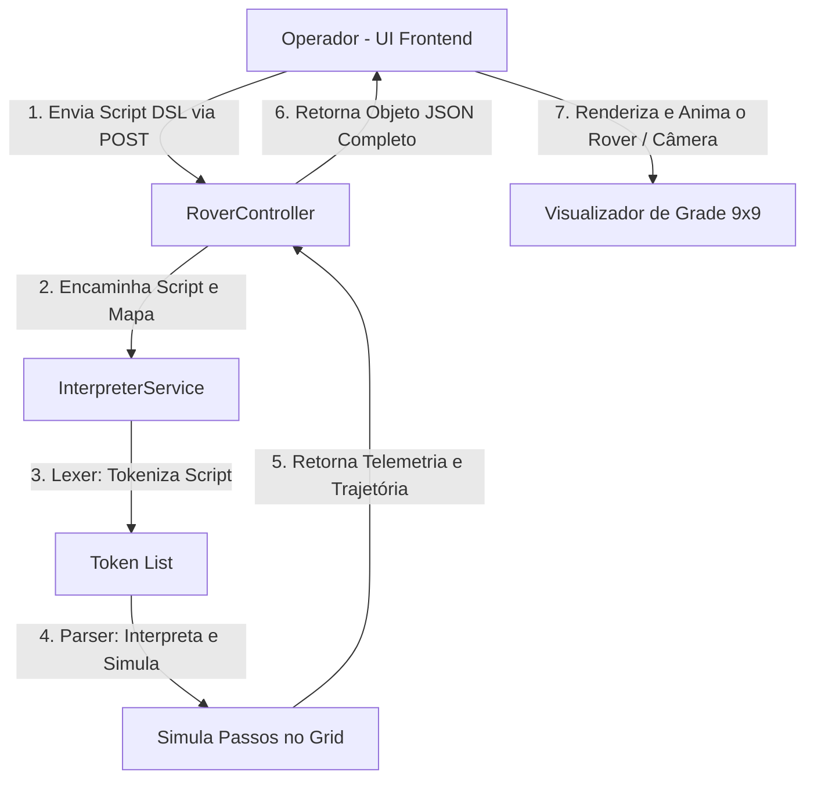
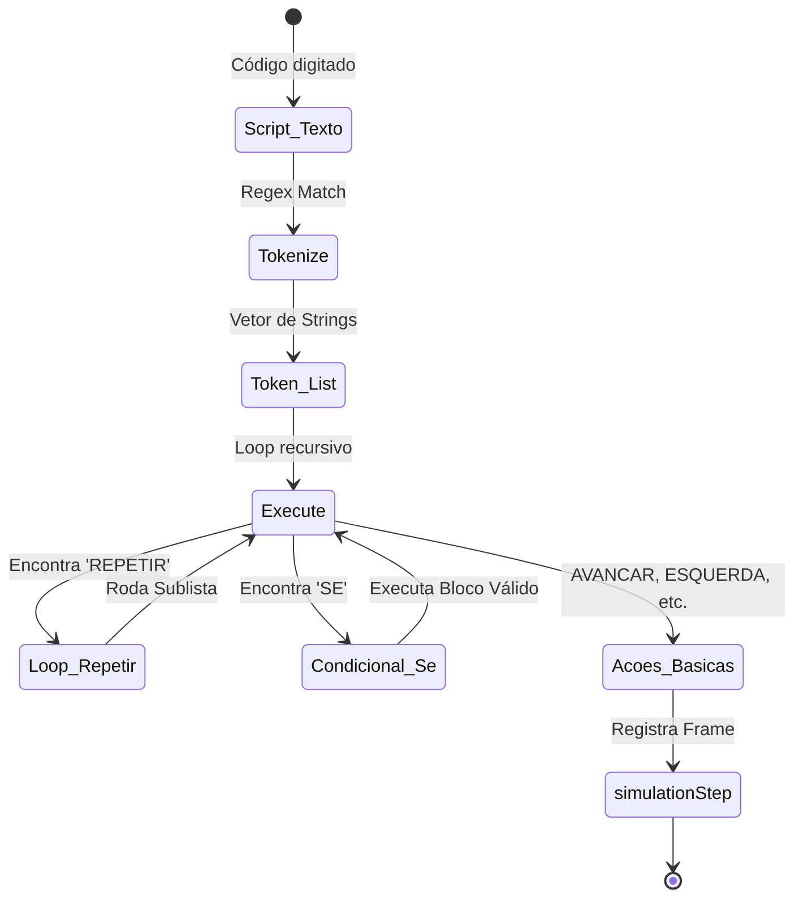

# Arquitetura e Engenharia de Sistemas - Rover Simulator A3

Este documento fornece um detalhamento completo de engenharia e arquitetura para o projeto **Rover Simulator A3**, cobrindo cada componente técnico, fluxos de dados, lógica do interpretador de linguagem DSL e design de interface/experiência de usuário (UI/UX) tanto no **Backend (Java / Spring Boot)** quanto no **Frontend (React Native / Expo)**.

---

## 1. Visão Geral da Arquitetura

O sistema é construído sobre uma arquitetura cliente-servidor desacoplada. O **Backend** é estruturado como uma API REST RESTful usando Java e Spring Boot, encarregada do controle do mapa, da geração procedimental de terreno e do interpretador lexer/parser da linguagem de script. O **Frontend** é desenvolvido com React Native (Expo) compilado para Web e Mobile, provendo uma central de controle simulada (HUD) com gráficos baseados em CSS, animações em 60fps usando a API nativa de animação e renderização baseada em Viewports.



---

## 2. Estrutura de Diretórios e Arquivos do Projeto

Abaixo está o mapa de diretórios essenciais das duas pontas do projeto:

```text
c:\faculdade\A3
├── docs/
│   └── ARCHITECTURE.md          <-- Este documento de engenharia
├── src/main/java/com/rover/simulator/
│   ├── RoverApplication.java    <-- Classe principal de inicialização Spring Boot
│   ├── controller/
│   │   └── RoverController.java <-- Controlador REST (API HTTP)
│   ├── model/
│   │   ├── Direction.java       <-- Enumeração das coordenadas de orientação (N, S, E, W)
│   │   ├── Grid.java            <-- Representação lógica e lógica de colisão/visibilidade
│   │   └── Rover.java           <-- Representação física do robô (posição e direção)
│   └── service/
│       └── InterpreterService.java <-- Interpretador Lexer, Parser e Simulação da DSL
└── frontend/
    ├── app/
    │   ├── _layout.tsx          <-- Inicialização global do Expo, carregamento de fontes e CSS
    │   ├── index.tsx            <-- Tela principal do simulador (Fluxo principal de renderização)
    │   └── manual.tsx           <-- Documentação interativa em tela
    ├── components/
    │   ├── ControlPanel.tsx     <-- Painel do operador com assistente de loops e condições
    │   ├── DocumentationHint.tsx<-- Banner informativo lateral
    │   ├── RoverGrid.tsx        <-- Câmera animada, renderizador 9x9 e robô com transições GPU
    │   ├── RoverStats.tsx       <-- Cartões com telemetria básica e HUD da Bússola Mecânica
    │   └── TelemetryLogs.tsx    <-- Registro incremental com categorização visual de mensagens
    ├── package.json             <-- Dependências de pacotes React Native / Expo
    └── tsconfig.json            <-- Configurações e diretivas do TypeScript
```

---

## 3. Detalhamento do Backend (Java / Spring Boot)

Toda a lógica de domínio, coordenadas e inteligência de parsing da linguagem está no backend. A aplicação usa conceitos de programação orientada a objetos (POO) puros e evita frameworks de banco de dados para maximizar a performance e isolamento do estado na memória do servidor.

### 3.1. O Domínio e Modelos (`com.rover.simulator.model`)

#### A. `Direction.java`
Uma enumeração com as quatro direções cardinais básicas e a matemática discreta de rotação em 90 graus:
* **`N` (Norte)**, **`S` (Sul)**, **`E` (Leste)**, **`W` (Oeste)**.
* **`turnLeft()`**: Retorna a orientação após girar 90 graus anti-horário.
* **`turnRight()`**: Retorna a orientação após girar 90 graus horário.

```java
public enum Direction {
    N, S, E, W;

    public Direction turnLeft() {
        return switch (this) {
            case N -> W;
            case W -> S;
            case S -> E;
            case E -> N;
        };
    }

    public Direction turnRight() {
        return switch (this) {
            case N -> E;
            case E -> S;
            case S -> W;
            case W -> N;
        };
    }
}
```

#### B. `Rover.java`
Classe com o estado posicional do veículo no terreno plano.
* Mantém duas coordenadas inteiras privadas `x` e `y` e a orientação cardinal `direction` baseada na enumeração `Direction`.
* Contém apenas construtores e métodos simplificados (Getters e Setters) de acesso.

#### C. `Grid.java`
Representa logicamente o solo marciano, controlando as posições tridimensionais, obstáculos, amostras científicas coletáveis e a visibilidade acumulada (Fog of War).
* **Estrutura interna**:
  * `width` e `height`: Dimensões do mapa (fixadas em 20x20).
  * `obstacles`: Um `Set<String>` contendo as posições de rochas intransponíveis, codificadas em strings no formato `"X,Y"` para garantir buscas em tempo constante $O(1)$.
  * `samples`: Um `Set<String>` contendo as amostras minerais coletáveis.
  * `revealedCells`: Um `Set<String>` que registra as células visíveis na tela.
* **Lógica de Revelação (`revealCell`)**:
  Calcula um raio de revelação quadrado em torno do centro fornecido e armazena no conjunto global de visibilidade. Retorna apenas as novas células reveladas nesta execução específica para habilitar revelações incrementais e efeito de fade-in no frontend.

```java
public List<String> revealCell(int centerX, int centerY, int radius) {
    List<String> newCells = new ArrayList<>();
    for (int x = centerX - radius; x <= centerX + radius; x++) {
        for (int y = centerY - radius; y <= centerY + radius; y++) {
            if (!isOutOfBounds(x, y)) {
                String key = x + "," + y;
                if (revealedCells.add(key)) {
                    newCells.add(key);
                }
            }
        }
    }
    return newCells;
}
```

---

### 3.2. O Interpretador Customizado (`InterpreterService.java`)

Este é o motor de execução do simulador. O interpretador traduz e executa a linguagem inventada RoverDSL em duas etapas clássicas:



#### A. A Análise Léxica (Lexer / Tokenização)
O método `tokenize` utiliza uma expressão regular compilada para separar palavras chaves, números de passo/repetição, e delimitadores de escopo de bloco:
```java
Pattern pattern = Pattern.compile("[a-zA-Z]+|\\d+|\\{|\\}");
```
* **`[a-zA-Z]+`**: Captura identificadores e palavras-chave (`AVANCAR`, `ESQUERDA`, `REPETIR`, `SE`, `OBSTACULO`, `ELSE`, `COLETAR`, `SCAN`).
* **`\\d+`**: Captura inteiros (quantidade de passos ou repetições de loop).
* **`\\{|\\}`**: Captura os delimitadores estruturais (chaves abertas e fechadas).

Todos os tokens são convertidos para caixa alta (`toUpperCase()`) no momento do casamento léxico para tornar a linguagem insensível à capitalização de letras (case-insensitive).

#### B. A Análise Sintática e Execução Recursiva (Parser / Interpreter)
O método principal `execute` processa a lista linear de tokens usando um ponteiro indexador de instruções `index`.
```java
private int execute(List<String> tokens, Grid grid, Rover rover, SimulationResult result, int index) throws Exception
```
O método lê cada token sequencialmente e executa sua respectiva função lógica:

1. **Movimento (`AVANCAR` e `RECUAR`)**:
   Chama o método auxiliar `handleMove()`. Este consome o token numérico adjacente para definir os passos. A cada passo unitário executado:
   * Calcula a nova coordenada projetada baseado na direção do Rover.
   * Verifica se colidiu com as paredes do mapa (`isOutOfBounds()`). Caso colida, gera um log de falha e define `outOfBounds = true`, abortando a simulação imediatamente.
   * Verifica se colidiu com um obstáculo físico (`isObstacle()`). Se colidir, marca a flag `collision = true` e interrompe a missão.
   * Se a movimentação for bem sucedida, atualiza as coordenadas reais do Rover, revela um raio de 1 célula em torno da nova coordenada, adiciona as revelações ao passo atual e gera um log normal de movimento.

2. **Curva / Giro (`ESQUERDA` e `DIREITA`)**:
   Implementado pelo método `handleTurn()`. O interpretador verifica se o token logo após o comando é um número inteiro válido (ex: `DIREITA 2` ou `ESQUERDA 3`).
   * Se for numérico, ele consome o token e executa o giro $N$ vezes em sequência.
   * Se for qualquer outra instrução ou string (ex: `DIREITA` seguido de `AVANCAR`), o interpretador presume que o multiplicador é $1$ e não consome o próximo token, mantendo compatibilidade com scripts manuais sem contagem de giros.
   
3. **Varredura Ativa (`SCAN`)**:
   Ativa os radares do Rover. Expande instantaneamente a visibilidade do mapa (Fog of War) em um raio de **3 células** em torno do Rover (uma grade de 7x7 revelada na hora). Também verifica se há algum obstáculo físico diretamente na célula à frente do Rover, definindo `obstacleDetected` como verdadeiro ou falso.

4. **Coleta de Material (`COLETAR`)**:
   Executa a coleta no solo. O método acessa a célula atual do Rover e tenta capturar a amostra. Se encontrada no `Grid`, a remove e define a flag `sampleCollected = true`, terminando a missão com sucesso de exploração.

5. **Laços de Repetição (`REPETIR`)**:
   Implementado pelo método `handleFor()`.
   Consome o token numérico correspondente ao número de iterações e valida a presença da abertura de escopo `{`. O índice do primeiro token interno ao bloco é salvo em `loopStart`.
   O interpretador então executa o bloco de instruções internas sequencialmente chamando o método `execute` recursivamente passando `loopStart` como origem. Ao término de cada iteração completa do loop, o índice do ponteiro de instruções é reiniciado para `loopStart`. Quando todas as iterações forem executadas, o interpretador retorna o ponteiro avançado após o fechamento do caractere de chave `}`.

6. **Condicional Alternativa (`SE`)**:
   Implementado por `handleIf()`. O interpretador verifica se a sintaxe correta é `SE OBSTACULO {`.
   * Executa uma verificação virtual da célula adjacente no vetor de direção atual (`checkObstacleAhead()`).
   * Se um obstáculo ou limite de mapa for encontrado na frente e a condição for verdadeira: executa recursivamente as instruções internas contidas no escopo das chaves do bloco `SE`. Ao término, avança o índice do script pulando o bloco `ELSE` correspondente (se presente).
   * Se a condição for falsa (caminho livre): o interpretador executa um laço simples para encontrar o fechamento correspondente das chaves `}` pulando a execução desse bloco. Caso haja um bloco `ELSE` na sequência, o interpretador entra e executa recursivamente as chaves dele.

---

### 3.3. A Camada de Controle (`RoverController.java`)

Gerencia as chamadas via HTTP e mantém o estado do mapa ativo em memória na variável `currentGrid`.

#### Endpoints Disponíveis
| Endpoint | Método | payload / Retorno | Descrição |
| :--- | :--- | :--- | :--- |
| `/api/rover/simulate` | `POST` | Envia `{ script: String }`. Retorna `SimulationResult` | Executa o script contra o mapa atual e retorna todos os frames de animação e dados de grade. |
| `/api/rover/world` | `GET` | Retorna coordenadas de obstáculos, posições de amostras e raio inicial | Lê o mapa atual. Se o mapa não foi gerado, cria um novo automaticamente. |
| `/api/rover/reset` | `POST` | Retorna o JSON de dados do novo mapa | Limpa o mapa anterior da memória e gera um novo solo com novos obstáculos e amostras. |

#### Algoritmo Procedimental de Terreno (`generateNewWorld`)
Gera mapas dinâmicos usando um algoritmo aleatório com restrições:
1. Cria a grade com dimensão padrão de 20x20 células.
2. Sorteia uma quantidade de obstáculos entre **60 e 100**.
3. Distribui os obstáculos de forma homogênea no terreno, garantindo que a coordenada inicial de pouso (`10,10`) nunca receba um obstáculo.
4. Sorteia a posição da amostra mineral científica. Utiliza uma estrutura `do-while` para garantir que a amostra nunca seja colocada em cima de um obstáculo pré-existente ou na mesma célula de pouso do Rover (`10,10`).
5. Executa a liberação inicial da névoa de guerra (Fog of War) em um raio de **1 célula** (bloco 3x3) em torno do local de pouso, evitando que o jogador comece a simulação às cegas.

---

## 4. Detalhamento do Frontend (React Native / Expo)

O frontend utiliza uma interface estilizada em **Cyberpunk/Sci-Fi Dark Mode** para simular uma tela de controle da NASA. Todo o design é responsivo, adaptando-se a telas de computadores desktop grandes e smartphones.

### 4.1. Visualizador Dinâmico de Grade e Câmera (`components/RoverGrid.tsx`)

Esta é a parte central e de maior complexidade de interface do projeto. O componente renderiza uma visualização 9x9 (Viewport) em torno do Rover e utiliza a biblioteca **`Animated` nativa do React Native** para mover a grade inteira de forma fluida.

```text
+----------------------- GridContainer (9x9 fixo com overflow:hidden) ------------------------+
|                                                                                              |
|  +------------------- gridScrollContainer (20x20 células físicas) -----------------------+  |
|  | [0,0] [1,0] [2,0] ...                                                                 |  |
|  |                                                                                       |  |
|  |          (A Câmera move este contêiner baseado em cameraAnim.x e cameraAnim.y)        |  |
|  |                                                                                       |  |
|  |             +------------+                                                            |  |
|  |             |  ROVER     | <-- Elemento absoluto posicionado na coordenada do mundo    |  |
|  |             | (Animado)  |     (translateX: roverAnim.x, translateY: roverAnim.y)     |  |
|  |             +------------+                                                            |  |
|  |                                                                                       |  |
|  | ...                                                                                   |  |
|  +---------------------------------------------------------------------------------------+  |
|                                                                                              |
+----------------------------------------------------------------------------------------------+
```

#### A. O Conceito de Câmera Suave (Scroll Viewport)
Nas versões comuns de jogos de grade, o mapa permanece parado e o robô pula instantaneamente de célula em célula. No Rover Simulator A3, a tela foca no Rover:
1. Calculamos o canto superior esquerdo ideal (`startX`/`startY`) para que o Rover fique centralizado na tela.
2. Limitamos `startX` e `startY` para que a tela não saia das bordas do mapa de 20x20.
3. Em vez de renderizar apenas os blocos visíveis, o componente renderiza o mapa físico inteiro de 20x20 em um contêiner absoluto de tamanho `size * cellSize`.
4. O contêiner de visualização externo (`gridInner`) tem tamanho fixo de `9 * cellSize` e propriedade `overflow: 'hidden'`.
5. Quando o Rover anda, as novas coordenadas geram novas posições de câmera. O contêiner interno translada suavemente em direção oposta usando a propriedade transform:
   `translateX = -startX * cellSize` e `translateY = -startY * cellSize`.
6. Como o contêiner de células e o Rover movem-se de forma sincronizada através de uma animação com a mesma duração (300ms), a transição da câmera e do movimento do Rover na tela se fundem, resultando em um efeito de câmera deslizante extremamente profissional e fluida.

#### B. As Animações Complexas do Rover
O Rover é renderizado como um elemento absoluto (`styles.roverAbsolute`) dentro da grade de rolagem. Suas coordenadas de renderização no mundo em pixels são:
* `left = (rover.x * cellSize) + offset` (onde `offset = cellSize * 0.075` para centralização exata).
* `top = (rover.y * cellSize) + offset`.

Para mover o Rover na tela sem travamentos, controlamos suas transformações visuais em um único array mapeado para aceleração por hardware GPU (`useNativeDriver: true`):

```typescript
transform: [
  { translateX: roverAnim.x },
  { translateY: roverAnim.y },
  { rotate: rotateStr },
  { scale: isDead ? deathPulse : isSuccess ? 1.2 : roverPulse }
]
```
* **Translação de Posição (`roverAnim`)**: Valores dinâmicos modificados por `Animated.timing` para deslizar entre coordenadas.
* **Giro Direcional (`rotateStr`)**: O ângulo de direção é interpolado a partir de valores de graus absolutos (ex: `0deg`, `90deg`, etc.).
* **Fórmula de Giro pelo Curto Caminho**: Evita que o Rover dê um giro completo de 360° ao virar, por exemplo, de Oeste (270°) para Norte (0°). Calculamos a menor diferença modular de ângulos:
  ```typescript
  const getShortestAngle = (currentAngle: number, targetAngle: number) => {
    let diff = (targetAngle - currentAngle) % 360;
    if (diff > 180) diff -= 360;
    else if (diff < -180) diff += 360;
    return currentAngle + diff;
  };
  ```
* **Animações de Estado**:
  * *Em Espera/Normal*: Um loop suave (`roverPulse`) altera a escala entre `0.93` e `1.08` continuamente, dando um aspecto dinâmico ao robô.
  * *Colisão/Destruição*: Se `isDead` for disparado, a grade inteira chacoalha horizontalmente através de uma sequência rápida (`deathShake`), e a escala do Rover pulsa rapidamente com fundo vermelho neon.
  * *Amostra Coletada*: Aumenta o tamanho do Rover e gera um efeito de brilho amarelo-dourado.
  * *Pulso de Radar (`scanPulse`)*: Desenha ondas circulares partindo do centro do robô que se expandem até um tamanho equivalente a grade 7x7 e desaparecem gradualmente (interpolação de escala e opacidade).

---

### 4.2. Bússola HUD e Telemetria (`RoverStats.tsx` & `TelemetryLogs.tsx`)

#### A. A Bússola Virtual
O cartão central de orientação possui uma bússola simulada em CSS. Uma agulha estilizada com ponteira vermelha (apontando para o Norte) e azul (Sul) é controlada pelo mesmo ângulo lógico de rotação do Rover. Ao virar para o Leste, a agulha aponta para a direita do HUD de forma sincronizada com o movimento tridimensional do mapa físico.

#### B. Registro Incremental e Painel de Limpeza
O terminal de telemetria é alimentado dinamicamente a cada passo da simulação. 
* As mensagens possuem coloração semântica baseada na gravidade: erros em vermelho neon, coletas bem-sucedidas em amarelo ouro, alertas em amarelo limão e movimentos comuns em azul suave.
* Adicionamos um botão com a propriedade `onClear` no topo do relatório que permite ao operador limpar o histórico de logs acumulados no console espacial com um clique.

---

### 4.3. Fluxo Principal do Simulador (`app/index.tsx`)

Esta tela orquestra o estado geral do jogo, gerenciando as conexões com as rotas do back-end.

```typescript
const handleRunSimulation = async (script: string) => {
  if (!script.trim()) return;
  setIsProcessing(true);
  
  try {
    const result = await simulateScript(script);
    // Atualiza obstáculos e amostras descobertas
    if (result.obstacles) setObstacles(...);
    
    if (result.steps) {
      for (const step of result.steps) {
        // Altera a posição do Rover que por sua vez ativa os hooks de animação no RoverGrid
        setRoverPos({ x: step.x, y: step.y, dir: step.dir });
        
        // Revela as células no mapa de forma sequencial / incremental
        if (step.newRevealedCells) {
          setRevealedCells(prev => [...new Set([...prev, ...step.newRevealedCells])]);
        }
        
        // Trata os estados de parada da simulação (Colisão, Sucesso, Fora do Mapa)
        if (step.collision) { setIsDead(true); break; }
        if (step.outOfBounds) { setIsLost(true); break; }
        if (step.sampleCollected) { setIsSuccess(true); break; }
        
        // Delay correspondente ao tempo da transição física da animação
        await new Promise(r => setTimeout(r, 350));
      }
    }
  } finally {
    setIsProcessing(false);
  }
};
```

#### Remoção de Reinicialização Automática
Anteriormente, ao bater ou coletar amostras, a tela do simulador reiniciava automaticamente após 1.5 a 2.5 segundos, impossibilitando a análise pós-missão. Removemos as chamadas de timeout forçadas no script principal do frontend. O Rover e o terreno agora permanecem estáticos na posição exata de colisão ou de coleta de amostra, e o operador tem controle total para revisar o terreno e iniciar um novo mundo de simulação clicando no botão manual de reinicialização.

---

## 5. Experiência do Usuário (UX) e Detalhes de Interface (UI)

O sistema de design foi criado especificamente para atender a padrões elevados de estética e legibilidade:

* **Paleta de Cores Cibernética**:
  * Fundo principal do espaço: `#050714` (Azul espacial ultra profundo).
  * Elementos principais de energia/HUD: `#00f2ff` (Ciano neon elétrico).
  * Detalhes de automação e loops: `#7000ff` / `#a855f7` (Roxo/Púrpura espacial).
  * Painéis e cartões: `rgba(15, 23, 42, 0.7)` com bordas translúcidas de `rgba(255, 255, 255, 0.1)` simulando efeito de **vidro escuro (Glassmorphism)**.
* **Tipografia Futurista**: Orbitron (para cabeçalhos, HUD, valores e estatísticas militares) combinada com Roboto Mono (para código DSL, coordenadas e mensagens de log de telemetria).
* **Scrollbars Customizados**: Adicionado via injeção CSS global nas plataformas Web para garantir que barras de rolagem nativas do navegador não quebrem a imersão visual do simulador de ficção científica.
* **Tamanho das Células**: O layout calcula dinamicamente o tamanho das células (`cellSize`) de acordo com as dimensões de tela detectadas do usuário, garantindo que o grid nunca quebre ou apresente distorção dimensional em telas mobile pequenas.
